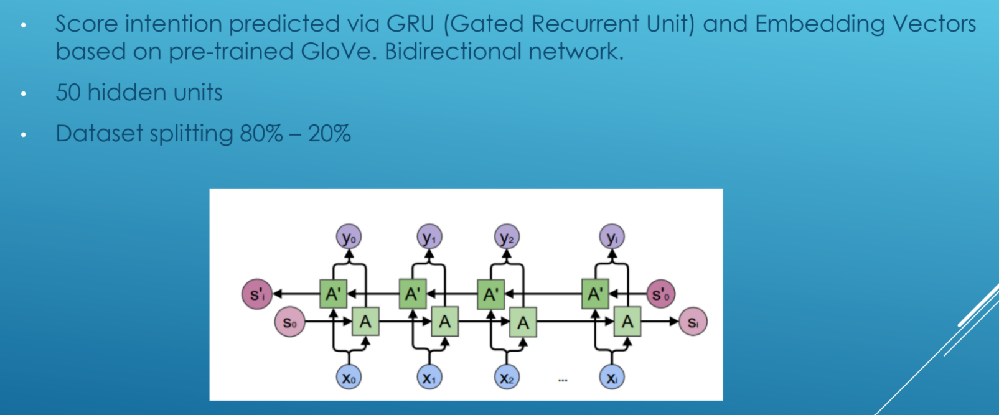

# Sentiment Analysis

This was a short sample of basic NLP applied to reviews in cosmetic products, which aims to predict the satisfaction of the clients for upcoming products using Bidirectional GRUs and GloVe embeddings.

See the `code_walkthrough.md` for a step by step explanation of the code.

